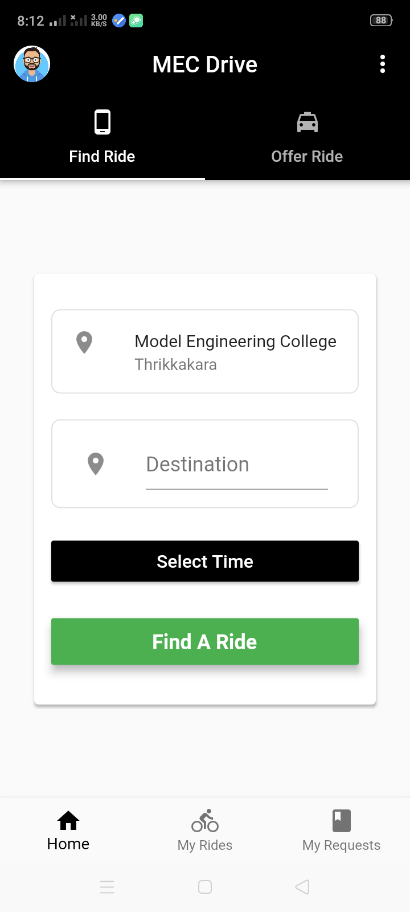
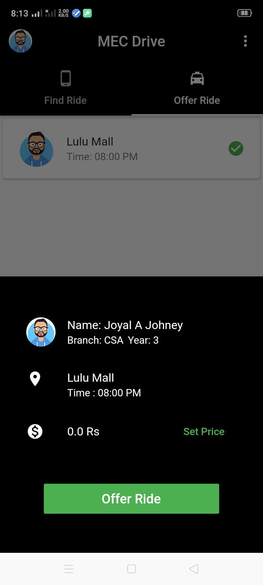

# RideZilla

RideZilla is a carpool application built for college students to promote shared travelling among college students. The application is currently in prototype stage. The application performs basic functionalities like authentication,send a ride request,accepting ride requests,contact students who has accepted the requests and delete ride requests.

   

